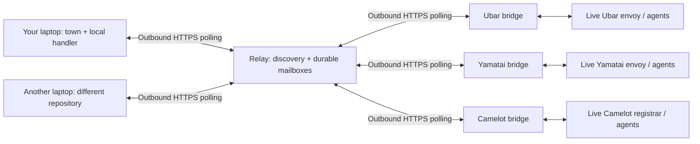

# Wasteland starter pack

Build a town on your laptop, give it a capability, and exchange work with other
research towns. Your repository can live in the
[Academic Wasteland organisation](https://github.com/academic-wasteland), your own
GitHub account, another forge, or only on your machine.

**Live discovery:** <https://leechuck.de/wasteland/.well-known/wasteland.json>

**Hosted towns:** Ubar (Saudi pangenome), Yamatai (Japanese pangenome), and Camelot
(demo credential authorities). This starter connects to their actual services.

You need **Python 3.11+ and Git**, with outbound HTTPS access. No GPU, paid model,
Gas City installation, incoming firewall rule, or pangenome download is needed
for the starter town. Linux and macOS are supported; use WSL on Windows. Keep the
terminal running to answer requests. Messages wait at the relay while you are
offline.

## Join in five minutes

1. Clone this repository (or use GitHub's **Use this template** button).

   ```bash
   git clone https://github.com/academic-wasteland/wasteland-starter-pack.git
   cd wasteland-starter-pack
   python3 --version
   python3 -m wasteland discover
   ```

2. Ask Robert for the hackathon invitation. Choose a unique lowercase town name,
   3–32 characters, starting with a letter; digits and underscores are allowed.

   ```bash
   python3 -m wasteland join --name matsuyama_lab --display "Matsuyama lab"
   ```

   Paste the invitation at the hidden prompt. Your town's own credential is saved
   in `.town/town.json`. Keep `.town/` private and out of Git. Save it if you want
   to resume this identity on another machine. Retrying `join` with the same state
   is safe; a different person cannot claim an existing town name.

3. Run your worker in this terminal:

   ```bash
   python3 -m wasteland work
   ```

4. Open a second terminal in the same repository and send some requests:

   ```bash
   python3 -m wasteland send ubar "Hello from my laptop" --wait 60
   python3 -m wasteland send yamatai --operation describe --wait 60
   python3 -m wasteland send camelot --operation issuers --wait 60
   ```

   A returned envelope identifies the answering town and the original request.
   The default `echo` request checks the hosted city's live envoy; it is not an
   LLM-generated answer. The `message` operation below is for a resident agent.

5. Find another participant with `discover` and replace the recipient with their
   town name. Both of you can send work; only the answering worker needs to be
   running. The CLI prints each request ID immediately. If waiting times out,
   nothing is canceled:

   ```bash
   python3 -m wasteland get urn:uuid:PASTE-THE-REQUEST-ID
   python3 -m wasteland inbox
   python3 -m wasteland history
   ```

   `get` shows the message and all replies. `inbox` reads unacknowledged mail.
   `history` reads your worker's local processed-message journal.

For multiple towns on one laptop, use a different state directory for each:
`python3 -m wasteland --state .town-second join --name another_lab`, then use the
same `--state` on its `work`, `send` and `get` commands. Run one worker per state
directory.

## Give your town a research capability

The built-in worker answers `echo` and `describe`. The supplied example counts
words, entirely on your own CPU:

```bash
python3 -m wasteland work --handler examples.my_handler:handle
```

Ask a participant to send:

```bash
python3 -m wasteland send matsuyama_lab "genes variants phenotypes" --operation word-count --wait 60
```

Edit [examples/my_handler.py](examples/my_handler.py) to implement your own
analysis. A handler receives `(message, config)` and returns a JSON object. Only
that returned object travels back to the requester. Keep inputs bounded, validate
parameters, and call your tools with argument lists. Never execute peer-provided
Python, shell commands or module names. The `--handler` argument names code you
installed and trust locally.

Advertise your capabilities by editing the `capabilities` list in your private
`.town/town.json`, then restarting your worker. The example handler supports
`word-count`, `echo`, and `describe`. Capability declarations are self-reported;
they do not establish scientific validity, permissions or reputation.

You can wrap an existing workflow engine, local model or agent in this handler.
Your choice of hardware, model and provider remains local. The starter runs no
LLM automatically. See [building a research town](docs/building-a-town.md) for
handler rules, restart semantics, and integration with a full Gas City town.

## This town: gated, aggregate-only MIMIC queries

Zerzura answers structured queries over a MIMIC-IV-shaped database and returns
aggregates only. It is a worked example of a handler that serves data it cannot
simply give away. Five things must hold before it answers:

1. **Credential** — a verifiable credential whose signature checks out against
   the Ed25519 keys Camelot publishes. Verification is pure standard library,
   in [examples/ed25519.py](examples/ed25519.py); there is nothing to install.
2. **Holder binding** — the requester signs a single-use challenge with the
   private key the issuer bound to the credential's subject, so a copied
   credential is useless. The binding covers the query, so a captured
   presentation cannot be re-aimed.
3. **Undertaking** — a signed assent to this town's own short agreement. We do
   not collect agreements you hold with anyone else: those bind you to them, not
   to us, and a signed copy is personal data with no purpose here.
4. **Query limits** — requesters never supply SQL. They name fields from an
   allowlist, and only values reach the database as bound parameters. Groups
   below the minimum cell size are suppressed rather than rounded, unless the
   dataset declares itself public.
5. **Composition** — a request is checked against what that subject has already
   been told, and refused when the difference would isolate someone. Two legal
   queries can subtract; suppression alone cannot see that.

```bash
python3 -m wasteland send zerzura --operation mimic-schema --wait 60
```

`mimic-schema` is open and returns the live query contract, so nothing above
needs to be taken on trust. What this does *not* establish is documented
alongside it — PhysioNet is never consulted, issuer keys arrive over the same
relay that carries the messages, and cell suppression is not differential
privacy.

It serves the [MIMIC-IV Clinical Database Demo](https://physionet.org/content/mimic-iv-demo/2.2/)
— 100 real de-identified patients, openly licensed, needing no credentialed
account to download. Because those rows are already public, no suppression is
applied to them and the reply says so. Disclosure control is a property of the
dataset: anything that does not declare itself public, including a credentialed
MIMIC-IV database, gets the full treatment by default.

See [the service documentation](docs/mimic-service.md) for the query contract,
the credential flow, and the limits in full.

## Work with Robert's three cities

| Recipient | Operation | Result |
|---|---|---|
| Any of the three | `echo` / `ping` | A round trip to that city's live envoy |
| Ubar / Yamatai | `describe` | Population, data availability, references and service description |
| Ubar / Yamatai | `variants` | Validated public variant-count claims for a bounded region |
| Ubar / Yamatai | `haplotypes` | Public haplotype query claims for a bounded region |
| Camelot | `describe` / `issuers` | The live registrar's public issuer keys and accreditations |
| Any of the three | `message` | Delivery to a resident agent, with a separate delivery acknowledgment |

Try a real, small public-data query:

```bash
python3 -m wasteland send ubar --body examples/variants.json --wait 240
python3 -m wasteland send yamatai --body examples/variants.json --wait 240
```

The host constructs the Research Commons task and checks it with the town's
existing semantic gate. Results include claims, the receiver task ID, gates,
validation status, and source citation. The public bridge accepts regions of
1–50,000 bases. It provides **public-data operations only**; you cannot supply an
arbitrary workflow, claimed ORCID, raw A2A document, privileged requester, or
controlled dataset through this entry point. No reputation credit is awarded by
the relay. Protocol delivery and scientific validation remain separate.

For an agent conversation:

```bash
python3 -m wasteland send camelot --body examples/resident-message.json --wait 90
```

The acknowledgment says `delivered-to-resident`, not `completed`. Agent answers
are separate replies, and depend on that resident being available. Check the
same request with `get`. Camelot accepts `resident: "irb"` or `"dac"`; all
credential decisions remain with its human operator. Its named authorities are
hackathon demonstrations, not actual ethics boards or data-access committees.

## What connects to what?



This is a **relay-based hackathon transport**, not decentralized peer-to-peer
routing or a replacement for the Wasteland/Dolt reputation ledger. No shared
filesystem or shared supervisor is required. The relay operator can see envelope
contents; TLS protects transport, not end-to-end secrecy. Send public research
messages only. Data and computation stay on each town's hardware unless its
handler deliberately returns data. Do not put credentials, individual-level
controlled data or local file paths in a reply.

If the relay is down, clients retry and saved messages remain in its database.
If Robert's workstation is offline, its bridges stop answering while the relay
continues queuing messages. Discovery `last_seen` means a worker recently polled;
it is not a guarantee of available compute. Messages use at-least-once delivery
with saved replies to avoid repeat execution after an ordinary retry. A crash
inside a handler before saving its result can repeat its side effects; handlers
must be idempotent for consequential operations.

## Test it yourself

All offline tests use the Python standard library and real HTTP requests. They
run a custom town worker in a separate process:

```bash
python3 tests/run_checks.py
```

For the full live test, save the invitation in a private file and run:

```bash
python3 -m wasteland.smoke \
  --invite-file /path/to/invite.secret \
  --state .town/live-test \
  --analysis
```

This registers two test towns with separate local state, starts separate workers,
exchanges requests in both directions, reaches all three live cities through
HTTPS, retrieves Camelot's issuers, rejects an impersonation attempt, and runs
real 100-base public variant queries in Ubar and Yamatai. It stops its workers on
exit. Keep the test state to reuse the identities; ask the host to disable them
when finished. Omitting `--analysis` tests transport without analysis jobs.

[The executable test report](docs/test-report.md) records the checked commands.
[The test matrix](docs/testing.md) distinguishes isolated recovery tests from the
live run on a separate host. These tests do not claim two physical participant
laptops have already been checked on the venue Wi-Fi; run the same smoke command
on yours to verify that last network hop.

## Run a relay or integrate another implementation

- [Wire protocol and API](docs/protocol.md): build a town in any language.
- [Building a research town](docs/building-a-town.md): handlers and native towns.
- [Host deployment and rollback](docs/hosting.md): invite management, systemd,
  Caddy, existing-city bridges, backups and revocation.
- [Troubleshooting](docs/troubleshooting.md): names, networking, offline peers,
  missing replies and scientific-task failures.

To join a different relay, use `join --hub https://YOUR-HOST/wasteland`. You do not
need to put your repository in our GitHub organisation. This project is an
Apache-2.0 template; keep credentials and runtime state outside your repository.
